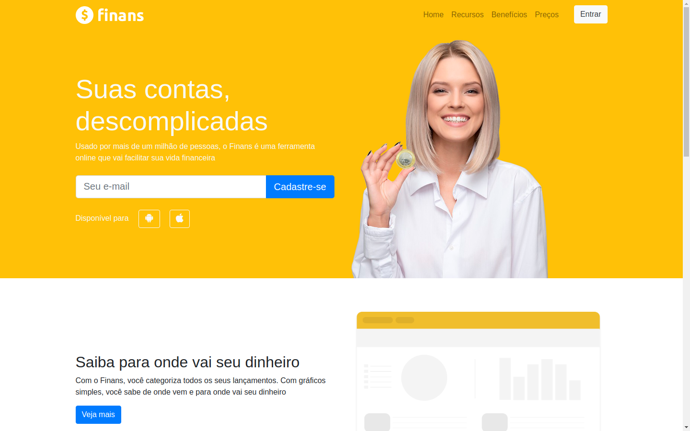

# finans
A website model with responsive design and various CSS elements.

This websit was built using bootstrap and yours elements. Used classes: 
  * bootstrap and icons from CDN,
  * "navbar",
  * menu with "collapse",
  * oculting pictures in small layouts,
  * responsive layout using grid and flex-box,
  * styled buttons,
  * links with icons from awesome.
